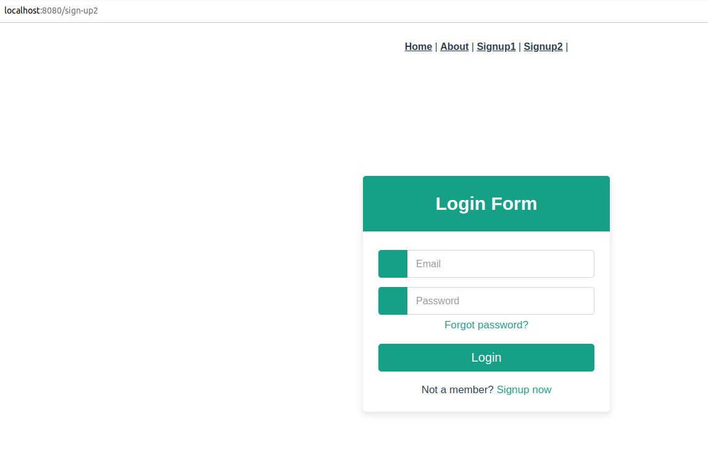
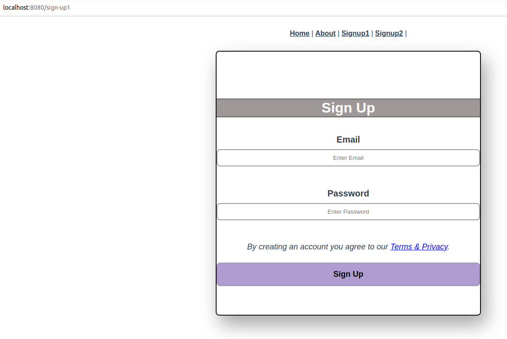

# modal-project-vue

## Project setup
```
npm install
```

### Compiles and hot-reloads for development
```
npm run serve
```

### Compiles and minifies for production
```
npm run build
```

### Customize configuration
See [Configuration Reference](https://cli.vuejs.org/config/).

### Vue JS project for practice with 4 pages 2 view type pages and 2 components

## sign up page 1


## sign up page 2


